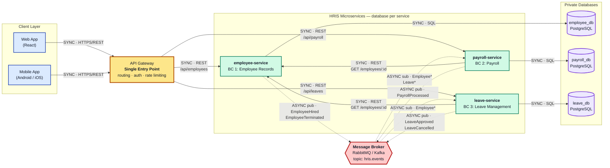
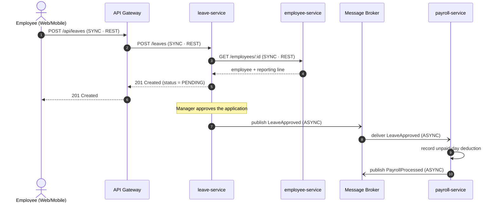

# Part 4 — Initial Architecture Diagram (HRIS)

**System:** Human Resource Information System (HRIS)
**Style:** Microservices — API Gateway, database-per-service, event-driven integration

---

## Rendered Diagram


---

## High-Level Architecture (Mermaid source)

Legend:

- **Solid arrow** = **SYNC** — synchronous communication (HTTP/REST or SQL, request/response)
- **Dotted arrow** = **ASYNC** — asynchronous communication (events via the message broker)



### Communication summary

| From | To | Type | Protocol / Mechanism | Purpose |
|------|----|------|----------------------|---------|
| Web / Mobile App | API Gateway | **SYNC** | HTTPS/REST | All external traffic |
| API Gateway | employee-service | **SYNC** | HTTP/REST `/api/employees` | Employee CRUD |
| API Gateway | payroll-service | **SYNC** | HTTP/REST `/api/payroll` | Pay runs, payslips |
| API Gateway | leave-service | **SYNC** | HTTP/REST `/api/leaves` | Leave applications |
| Each service | Its own database | **SYNC** | SQL (private, not shared) | Persistence |
| payroll-service | employee-service | **SYNC** | REST `GET /employees/:id` | Verify job grade before a pay run |
| leave-service | employee-service | **SYNC** | REST `GET /employees/:id` | Resolve the approving manager |
| employee-service | Broker | **ASYNC** | `EmployeeHired`, `EmployeeTerminated` | Announce workforce changes |
| leave-service | Broker | **ASYNC** | `LeaveApproved`, `LeaveCancelled` | Announce time-off outcomes |
| payroll-service | Broker | **ASYNC** | `PayrollProcessed` | Announce a completed pay run |
| Broker | payroll-service | **ASYNC** | subscribes to `Employee*`, `Leave*` | Open/close salary records, apply unpaid-leave deductions |
| Broker | leave-service | **ASYNC** | subscribes to `Employee*` | Provision / freeze leave balances |

### Architectural rules enforced by this diagram

1. **Single entry point.** Clients never talk to a microservice directly; every external request
   passes through the API Gateway, which handles authentication, routing, and rate limiting.
2. **Database per service.** Each microservice owns a private database. No service issues a query
   against another service's database — that is what makes the contexts independently deployable.
3. **Synchronous only where an answer is needed now.** REST calls are used for read-only lookups
   that must return before the caller can proceed (resolving an approver, verifying a job grade).
4. **Asynchronous for state propagation.** Anything that only needs to *eventually* be reflected in
   another context (a new hire, an approved leave, a completed pay run) travels as an event through
   the broker, so a slow or down service never blocks the publisher.

---

## Supporting View — Leave-to-Payroll Event Flow

This sequence diagram shows the headline integration: an approved unpaid leave becoming a payroll
deduction, without Leave Management ever calling Payroll directly.



---

## Regenerating the diagram image

The raw source lives in [`architecture.mmd`](./architecture.mmd). `architecture-diagram.png` was
generated from it. To regenerate after an edit:

**Option A — Mermaid Live Editor (no install):**

1. Go to <https://mermaid.live>.
2. Paste the contents of `architecture.mmd`.
3. Click **Actions → PNG**.
4. Save the download as `docs/architecture-diagram.png`, overwriting the old file.

**Option B — Mermaid CLI (local):**

```bash
npm install -g @mermaid-js/mermaid-cli
mmdc -i docs/architecture.mmd -o docs/architecture-diagram.png -b white -w 2200
```
